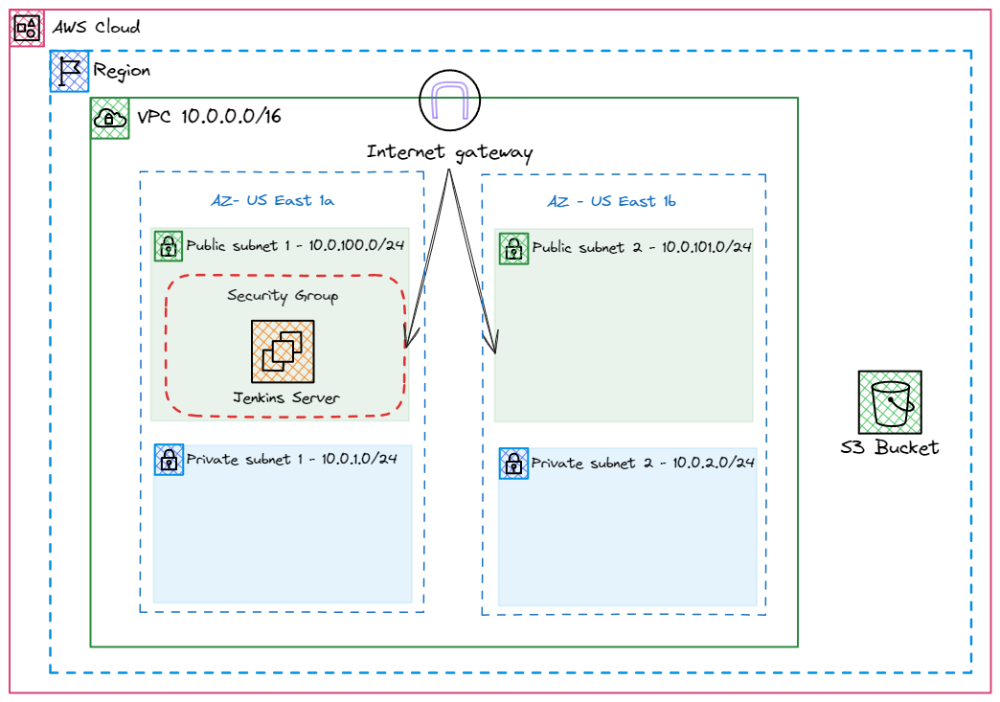

# Infrastructure as Code with Terraform - Jenkins on AWS

## Overview

This project facilitates the use of Infrastructure as Code (IaC) principles through the popular tool Terraform. The primary objective is to build and manage the infrastructure required for hosting a Jenkins server on AWS. This includes the provisioning of a Virtual Private Cloud (VPC), subnets, EC2 instance, Internet Gateway, route tables, and an S3 bucket for Jenkins artifacts storage.

## Architecture Diagram


## Components

The project consists of the following key components:

1. **VPC Configuration:**
   - A Virtual Private Cloud is set up with two public and private subnets each.
   - Internet Gateway is configured to allow communication with the outside world.
   - Route tables are appropriately set to manage traffic within the VPC.

2. **Jenkins Server on EC2:**
   - An EC2 instance is provisioned to host the Jenkins server.
   - The Jenkins server is initialized and configured for use.

3. **S3 Bucket for Jenkins Artifacts:**
   - An S3 bucket is created to store Jenkins artifacts, providing a reliable and scalable solution for artifact management.

## How to Use

### Prerequisites

Before deploying the infrastructure, make sure you have the following prerequisites:

- AWS account credentials configured locally.
- Terraform installed on your local machine.

### Deployment Steps

1. Clone the repository:

   ```bash
   git clone https://github.com/your-username/terraform-jenkins-aws.git
   cd terraform-jenkins-aws
   ```

2. Initialize Terraform:

   ```bash
   terraform init
   ```

3. Modify `terraform.tfvars` file with your AWS credentials and any other configuration parameters.

4. Review and validate the Terraform execution plan:

   ```bash
   terraform plan
   ```

5. Apply the changes to create the infrastructure:

   ```bash
   terraform apply
   ```

6. Confirm the changes when prompted.

## Cleanup

To destroy the infrastructure and resources created by Terraform, run:

```bash
terraform destroy
```

## Contributing

If you find any issues, have suggestions, or want to contribute to this project, feel free to open an issue or submit a pull request.

## License

This project is licensed under the [MIT License](LICENSE).
